# **LDAPs**

**Tabla de contenidos:**

- [**LDAPs**](#ldaps)
  - [**Enunciado**](#enunciado)
  - [**Realización**](#realización)
    - [**Certificado x509**](#certificado-x509)
    - [**Configuración de LDAP**](#configuración-de-ldap)
    - [**Conexión a LDAPs desde Delta**](#conexión-a-ldaps-desde-delta)
    - [**Conexión a LDAPs desde Bravo**](#conexión-a-ldaps-desde-bravo)

---

## **Enunciado**

Configura el servidor LDAP de *Alfa* para que utilice el protocolo *ldaps://* a la vez que el *ldap://* utilizando el certificado x509 de la práctica de https o solicitando el correspondiente a través de *gestiona*. Realiza las modificaciones adecuadas en los clientes ldap de *Alfa* para que todas las consultas se realicen por defecto utilizando *ldaps://*.

---

## **Realización**

### **Certificado x509**

Comenzaré por solicitar el certificado x509 a través de gestiona. Para ello, necesitaré conectarme a *Alfa* y crear el archivo de solicitud de firma *.csr*.

Pasos a seguir:

1. Conectarme a Alfa y escalar privilegios:

  ```bash
  ssh juanjesus@172.22.201.138 # Alfa

  sudo su -
  ```

2. Crear una clave privada:

  ```bash
  openssl genrsa 4096 > /etc/ssl/private/alfa.key
  ```

3. Crear el archivo de solicitud de firma *.csr*:

  ```bash
  openssl req -new -key /etc/ssl/private/alfa.key -out alfa.csr
  ```

  Los datos a introducir son los siguientes:

  ```bash
  Country Name (2 letter code) [AU]:ES
  State or Province Name (full name) [Some-State]:Sevilla
  Locality Name (eg, city) []:Dos Hermanas
  Organization Name (eg, company) [Internet Widgits Pty Ltd]:IES Gonzalo Nazareno
  Organizational Unit Name (eg, section) []:Informatica
  Common Name (e.g. server FQDN or YOUR name) []:alfa.juanjesus.gonzalonazareno.org
  ```

  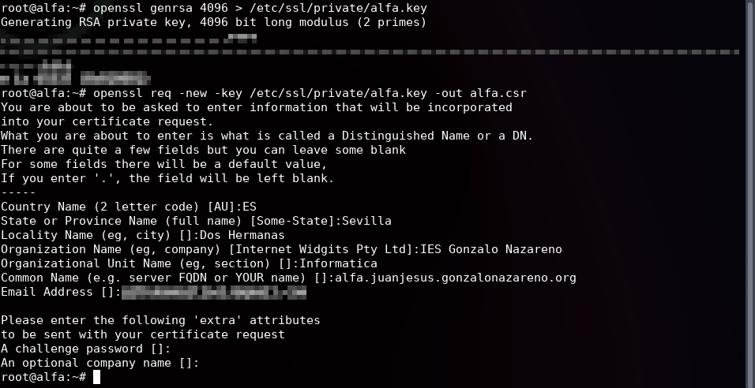

  

4. Solicitar el certificado x509 a través de gestiona:

  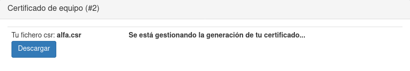

5. Una vez recibido el certificado x509, lo enviaremos y guardaremos en el directorio */etc/ssl/certs/* y le daremos permisos adecuados. También necesitaremos el fichero de la CA, *gonzalonazareno.crt*:

  ```bash
  mv alfa.crt /etc/ssl/certs/

  mv gonzalonazareno.crt /etc/ssl/certs/

  chown root:root /etc/ssl/certs/alfa.crt

  chown root:root /etc/ssl/certs/gonzalonazareno.crt
  ```

### **Configuración de LDAP**

Ahora, creo las ACLs para que el usuario *openldap* pueda acceder a los certificados, necesitaré tener el paquete *acl* instalado:

```bash
apt install acl

setfacl -m u:openldap:r-x /etc/ssl/private

setfacl -m u:openldap:r-x /etc/ssl/private/alfa.key

getfacl /etc/ssl/private

getfacl /etc/ssl/private/alfa.key
```

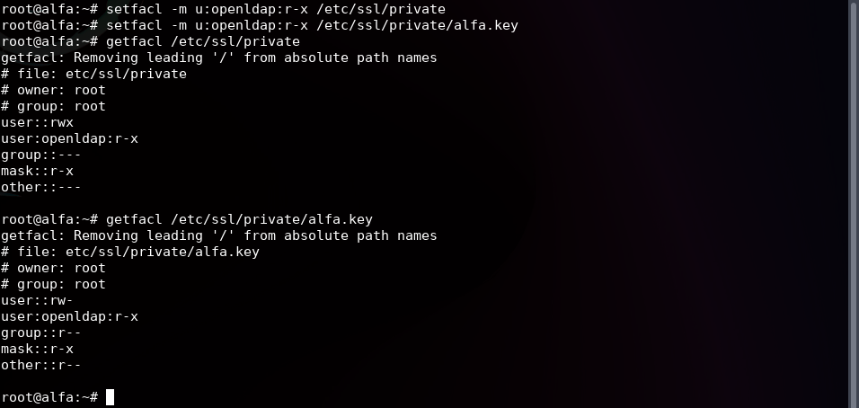

A continuación creo el fichero *ldif* que usaré para modificar la configuración de LDAP:

```bash
nano -cl ldaps.ldif
```

```ldif
dn: cn=config
changetype: modify
replace: olcTLSCACertificateFile
olcTLSCACertificateFile: /etc/ssl/certs/gonzalonazareno.crt
-
replace: olcTLSCertificateKeyFile
olcTLSCertificateKeyFile: /etc/ssl/private/alfa.key
-
replace: olcTLSCertificateFile
olcTLSCertificateFile: /etc/ssl/certs/alfa.crt
```

Y agrego la configuración mediante el comando *ldapmodify*:

```bash
ldapmodify -Y EXTERNAL -H ldapi:/// -f ldaps.ldif
```

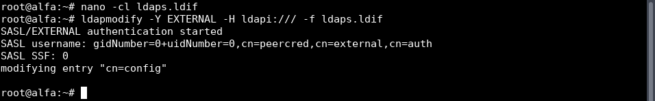

Edito la configuración de LDAP para que utilice el protocolo *ldaps://* mediante el puerto 636:

```bash
nano -cl /etc/default/slapd
```

```bash
SLAPD_SERVICES="ldap:/// ldapi:/// ldaps:///"
```

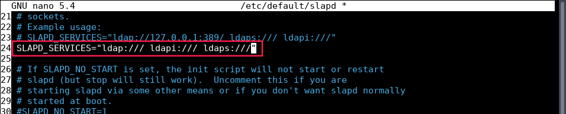

Y reinicio el servicio:

```bash
systemctl restart slapd
```

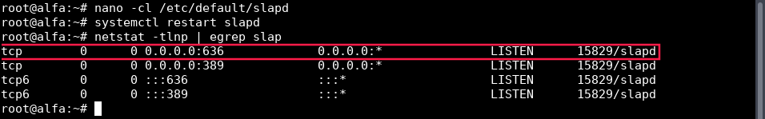

Copio el certificado de la CA a */usr/local/share/ca-certificates/*:

```bash
cp /etc/ssl/certs/gonzalonazareno.crt /usr/local/share/ca-certificates/
```

Y actualizo los certificados de la CA:

```bash
update-ca-certificates
```

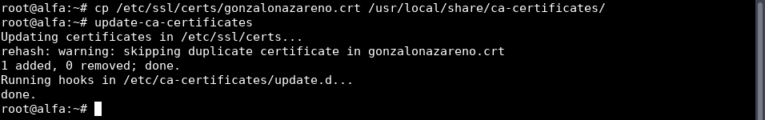

Envío a *Delta* que será mi cliente LDAPs el *.crt* de la CA, me conecto y lo ubico en la ruta correspondiente:

```bash
scp -o ProxyJump=juanjesus@172.22.201.138 gonzalonazareno.crt juanjesus@192.168.0.3:.

ssh -AJ juanjesus@172.22.201.138 juanjesus@192.168.0.3 # Delta

sudo su -

mv /home/juanjesus/gonzalonazareno.crt /usr/local/share/ca-certificates/

chown root:root /usr/local/share/ca-certificates/gonzalonazareno.crt

update-ca-certificates
```

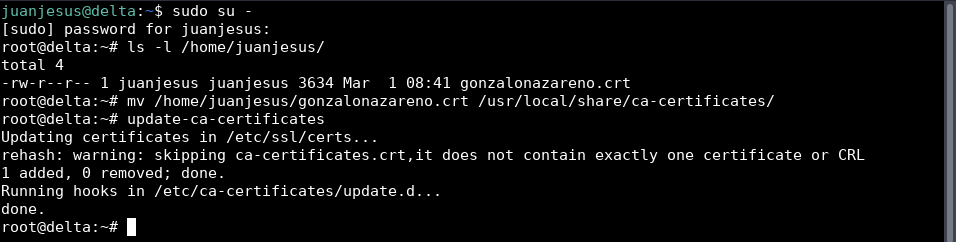

En este punto ya podremos lanzar consultas mediante *LDAPs*, para probarlo desde *Alfa*:

```bash
ldapsearch -x -b "dc=juanjesus,dc=gonzalonazareno,dc=org" -H ldaps://localhost:636
```

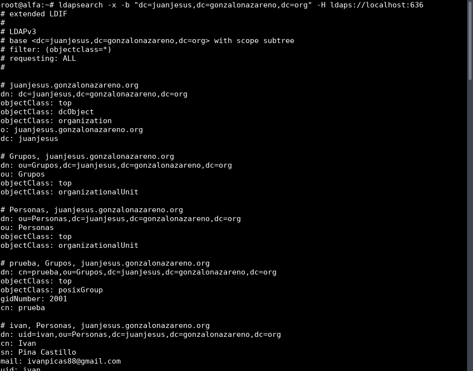

Y desde Delta:

```bash
ldapsearch -x -b "dc=juanjesus,dc=gonzalonazareno,dc=org" -H ldaps://alfa.juanjesus.gonzalonazareno.org:636
```

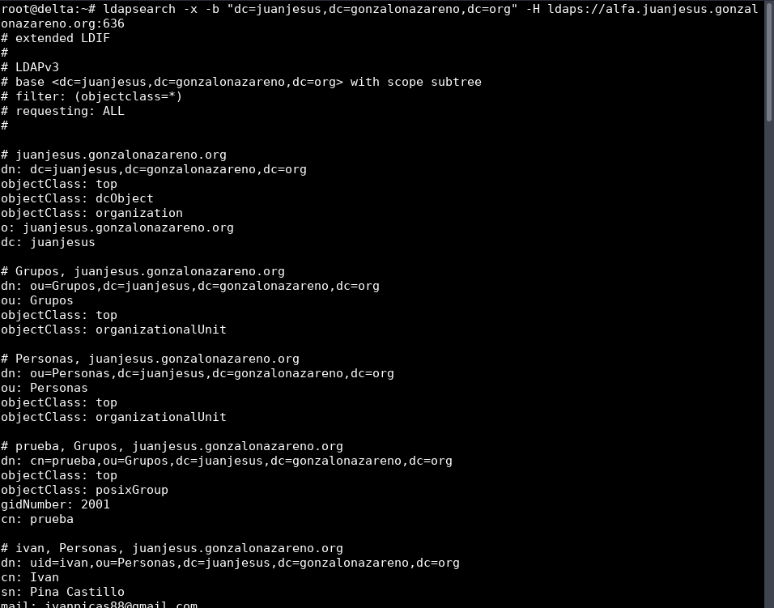

Una vez que ya sabemos que funciona, podemos configurar *LDAP* para que utilice únicamente el protocolo *ldaps://*, esto lo haré eliminando *ldap:///* y *ldapi:///* de la variable *SLAPD_SERVICES* en el fichero */etc/default/slapd* de *Alfa*:

```bash
nano -cl /etc/default/slapd

systemctl restart slapd
```

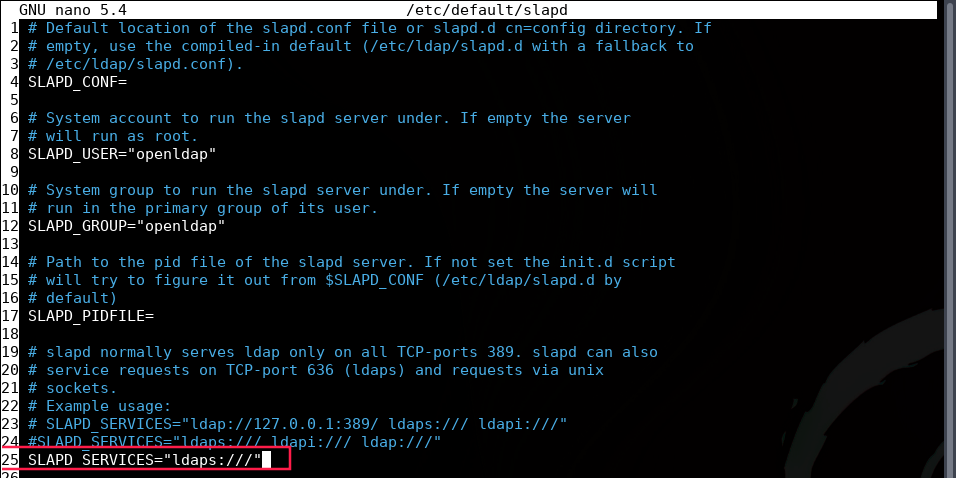

Si vemos el estado del servicio podremos ver que ahora solo lista el protocolo *ldaps://*:

```bash
systemctl status slapd
```

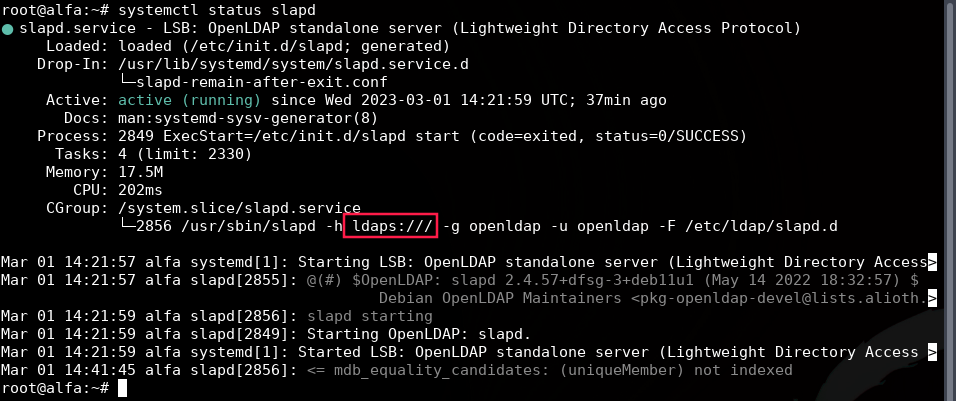

Para que *Delta* use solamente *LDAPs*, necesitaremos modificar su fichero */etc/ldap/ldap.conf* y sustituir *ldap://* por *ldaps://* en la variable *URI* (desde *Delta*):

```bash
nano -cl /etc/ldap/ldap.conf
```

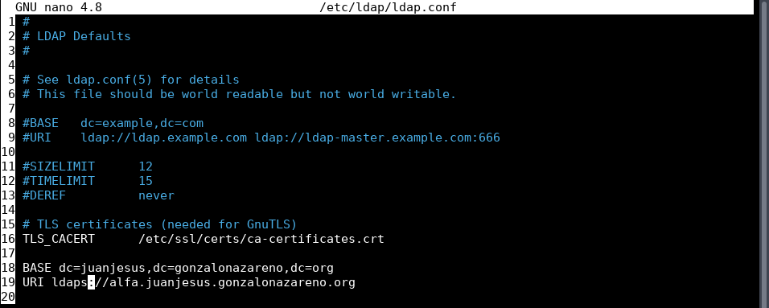

Si ahora consulto a *LDAP* desde *Delta*:

```bash
ldapsearch -x -b "dc=juanjesus,dc=gonzalonazareno,dc=org" -H ldap://alfa.juanjesus.gonzalonazareno.org
# Fallará porque hemos eliminado el protocolo ldap:// de la variable SLAPD_SERVICES en Alfa

ldapsearch -x -b "dc=juanjesus,dc=gonzalonazareno,dc=org" -H ldaps://alfa.juanjesus.gonzalonazareno.org:636
# Funcionará porque Alfa ahora solo escucha en ldaps://

ldapsearch -x -b "dc=juanjesus,dc=gonzalonazareno,dc=org"
# Funcionará porque ahora Delta por defecto utiliza ldaps://
```

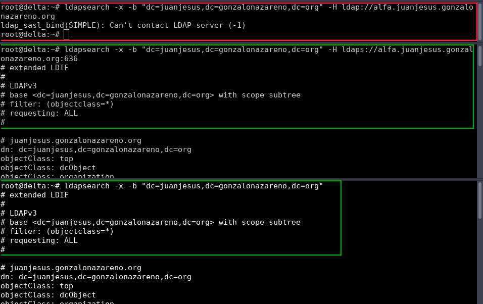

Configuro *ldaps* en *Alfa*:

```bash
nano -cl /etc/ldap/ldap.conf
```

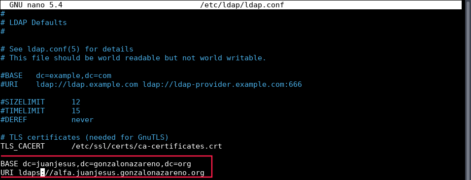

Y ahora, procedo a configurar la máquina *Bravo* para que pueda conectar con *LDAPs*. Primero, copio el certificado de la CA a *Bravo*, me conecto y lo ubico en la ruta correspondiente:

```bash
scp -o ProxyJump=juanjesus@172.22.201.138 gonzalonazareno.crt juanjesus@172.16.0.200:.

ssh -AJ juanjesus@172.22.201.138 juanjesus@172.16.0.200 # Bravo

sudo su -

mv /home/juanjesus/gonzalonazareno.crt /etc/pki/ca-trust/source/anchors/

chown root:root /etc/pki/ca-trust/source/anchors/gonzalonazareno.crt

update-ca-trust
```

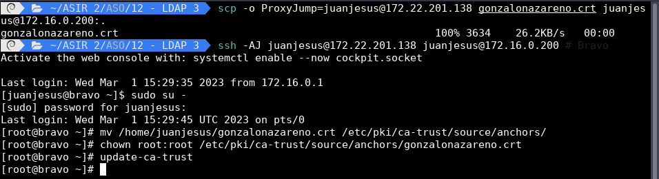

Ahora, procedo a configurar *Bravo* para que pueda conectarse a *LDAPs*:

```bash
nano -cl /etc/openldap/ldap.conf
```

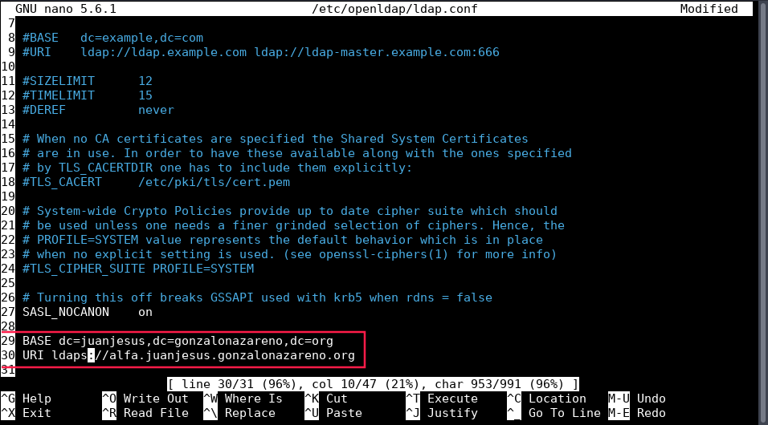

De nuevo, si ahora consulto a *LDAP* desde *Bravo*:

```bash
ldapsearch -x -b "dc=juanjesus,dc=gonzalonazareno,dc=org" -H ldap://alfa.juanjesus.gonzalonazareno.org
# Fallará porque hemos eliminado el protocolo ldap:// de la variable SLAPD_SERVICES en Alfa

ldapsearch -x -b "dc=juanjesus,dc=gonzalonazareno,dc=org" -H ldaps://alfa.juanjesus.gonzalonazareno.org:636
# Funcionará porque Alfa ahora solo escucha en ldaps://

ldapsearch -x -b "dc=juanjesus,dc=gonzalonazareno,dc=org"
# Funcionará porque ahora Bravo por defecto utiliza ldaps://
```

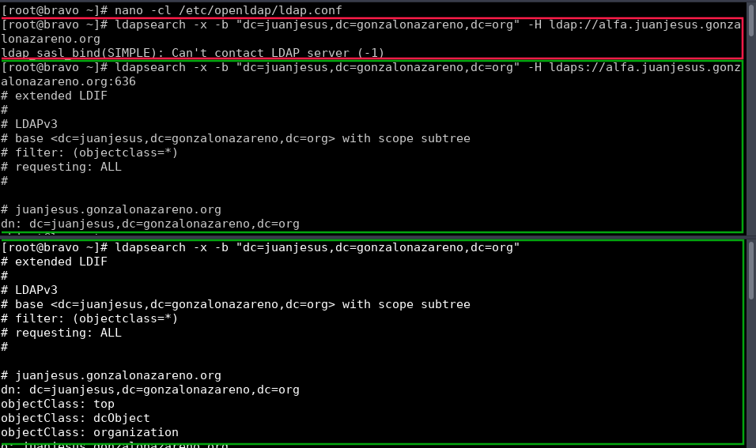

### **Conexión a LDAPs desde Delta**

Pruebo a conectarme al usuario *prueba* desde *Delta*:

```bash
su - prueba

ls -l LDAP3.txt

echo "Práctica ASO" > LDAP3.txt

cat LDAP3.txt

ls -l LDAP3.txt
```

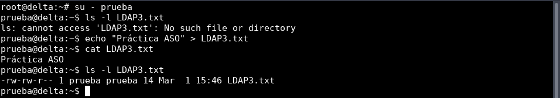

Y veo que funciona correctamente.

### **Conexión a LDAPs desde Bravo**

Pruebo a conectarme al usuario *prueba* desde *Bravo*:

```bash
su - prueba

cat LDAP3.txt

ls -l LDAP3.txt
```

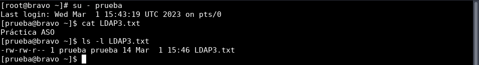

Podemos observar como funciona correctamente y se ve el fichero que hemos creado desde *Delta* y su contenido.

---

✒️ **Documentación realizada por Juan Jesús Alejo Sillero.**
